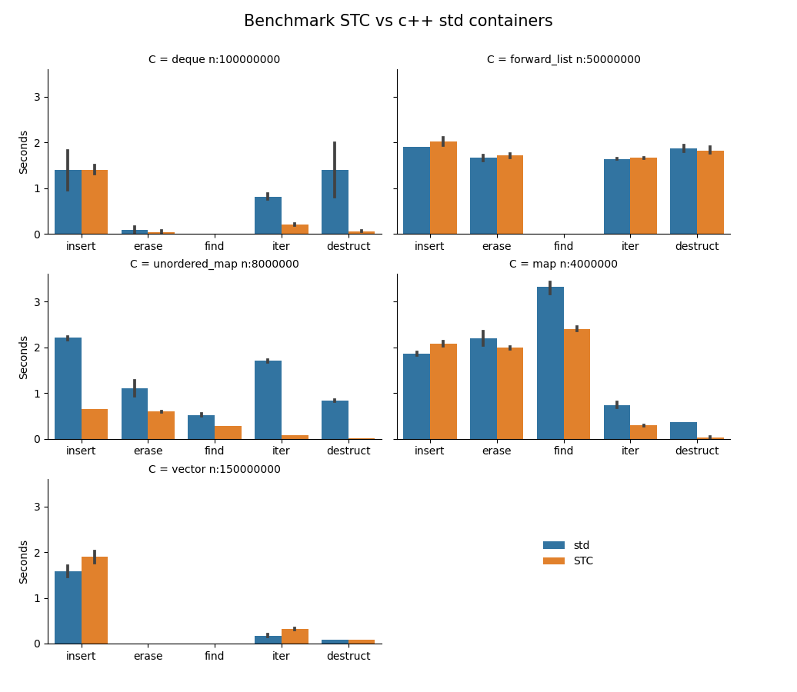

STC - Standard Template Containers
==================================

Introduction
------------

A modern, templated, user-friendly, fast, fully typesafe, and customizable container library for C99,
with a cross-containers uniform API, similar to c++ STL.

This is a compact, header-only library with the all the major "standard" data containers, except for the multi-map/set variants:
- [***carray*** - Templated **multi-dimensional array** type](docs/carray_api.md)
- [***cbits*** - A **std::bitset** / **boost::dynamic_bitset** alike type](docs/cbits_api.md)
- [***cdeq*** - Templated **std::deque** alike type](docs/cdeq_api.md)
- [***clist*** - Templated **std::forward_list** alike type](docs/clist_api.md)
- [***cmap*** - Templated **std::unordered_map** alike type](docs/cmap_api.md)
- [***cpque*** - Templated **std::priority_queue** alike adapter type](docs/cpque_api.md)
- [***cptr*** - Container pointers and **std::shared_ptr** alike support](docs/cptr_api.md)
- [***cqueue*** - Templated **std::queue** alike adapter type](docs/cqueue_api.md)
- [***cset*** - Templated **std::unordered_set** alike type](docs/cset_api.md)
- [***csmap*** - Templated sorted map **std::map** alike type](docs/csmap_api.md)
- [***csset*** - Templated sorted set **std::set** alike type](docs/csset_api.md)
- [***cstack*** - Templated **std::stack** alike adapter type](docs/cstack_api.md)
- [***cstr*** - A **std::string** alike type](docs/cstr_api.md)
- [***cvec*** - Templated **std::vector** alike type](docs/cvec_api.md)

Others:
- [***ccommon*** - General definitions and handy, safe-to-use macros](docs/ccommon_api.md)
- [***coption*** - Implements ***coption_get()***, similar to posix **getopt_long()**](docs/coption_api.md)
- [***crandom*** - A novel, extremely fast *PRNG* named **stc64**](docs/crandom_api.md)

Performance
-----------
The chart uses average times from results of four compilers: Win-Clang++ v11, Mingw64 g++ 9.20, VC19, Linux-clang v10. CPU: Ryzen 7 2700X CPU @4Ghz. 
The black bars indicates performance variation between various platforms/compilers.



This shows that the STC containers performs either equal or better than the c++ std counterparts (which
have been optimized for decades). **cmap** with default hash key is almost 3 times faster than *std::unordered_map*
on insert and erase, and has orders of magnitude faster iteration and destruction. Additionally, **csmap** is notable
faster on lookup than *std::map*'s typical red-black tree implementation. *csmap* uses an AA-tree (Arne Andersson, 1993),
which tends to create a flatter structure (more balanced) than red-black trees. Be aware of though, both *std::map* and
*csmap* are more than an order of magnitude slower than the unordered map implementations (n is 20 times smaller in the benchmarks).

Highlights
----------
- **User friendly** - Super easy usage, just include the header and you are good to go. The API and functionality is very close to c++ STL, and is fully listed in the docs. The ***using_***-declaration instantiates the container type to use. You may pass *optional* arguments to it for customization of value- *comparison*, *destruction*, *cloning*, *convertion types*, and more.
- **Unparalleled performance** - All the containers are either equal or faster than c++ STL containers.
- **Fully memory managed** - All containers will destruct keys, values via destructor passed as macro parameters to the ***using_***-declaration. Also smart-pointers are supported and can be stored in containers, see ***csptr***.
- **Fully type safe** - Avoids error-prone casting of container types and elements back and forth from the containers.
- **Uniform API** - Methods to ***construct***, ***initialize***, ***iterate*** and ***destruct*** have a uniform and intuitive usage across the various containers.
- **Small footprint** - Small source code and generated executables. The executable from the above example with six different containers is *26 kb in size* compiled with TinyC.
- **Dual mode compilation** - By default it is a simple header-only library with inline and static methods only, but you can easily switch to create a traditional library with shared symbols, without changing existing source files. See below how-to.

Usage
-----

The usage of the containers is similar to the c++ standard containers in STL, so it should be easy if you are familiar with them.
All containers are generic/templated, except for **cstr** and **cbits**. No casting is used, so containers are typesafe like
templates in c++. A basic usage example:
```c
#include <stc/cvec.h>

using_cvec(i, int);

int main(void) {
    cvec_i vec = cvec_i_init();
    cvec_i_push_back(&vec, 10);
    cvec_i_push_back(&vec, 20);
    cvec_i_push_back(&vec, 30);

    c_foreach (i, cvec_i, vec)
        printf(" %d", *i.ref);

    cvec_i_del(&vec);
}
```
And with multiple containers...
```c
#include <stc/cset.h>
#include <stc/cvec.h>
#include <stc/cdeq.h>
#include <stc/clist.h>
#include <stc/cqueue.h>
#include <stc/csmap.h>
#include <stdio.h>

struct Point { float x, y; };

int Point_compare(const struct Point* a, const struct Point* b) {
    if (a->x != b->x) return 1 - 2*(a->x < b->x);
    return (a->y > b->y) - (a->y < b->y);
}

// declare container types
using_cset(i, int);                         // unordered set
using_cvec(p, struct Point, Point_compare); // vector, struct as elements
using_cdeq(i, int);                         // deque
using_clist(i, int);                        // singly linked list
using_cqueue(i, cdeq_i);                    // queue, using deque as adapter
using_csmap(i, int, int);                   // sorted map

int main(void) {
    // define and initialize
    c_init (cset_i, set, {10, 20, 30});
    c_init (cvec_p, vec, { {10, 1}, {20, 2}, {30, 3} });
    c_init (cdeq_i, deq, {10, 20, 30});
    c_init (clist_i, lst, {10, 20, 30});
    c_init (cqueue_i, que, {10, 20, 30});
    c_init (csmap_i, map, { {20, 2}, {10, 1}, {30, 3} });

    // add one more element to each container
    cset_i_insert(&set, 40);
    cvec_p_push_back(&vec, (struct Point) {40, 4});
    cdeq_i_push_front(&deq, 5);
    clist_i_push_front(&lst, 5);
    cqueue_i_push(&que, 40);
    csmap_i_emplace(&map, 40, 4);

    // find an element in each container
    cset_i_iter_t i1 = cset_i_find(&set, 20);
    cvec_p_iter_t i2 = cvec_p_find(&vec, (struct Point) {20, 2});
    cdeq_i_iter_t i3 = cdeq_i_find(&deq, 20);
    clist_i_iter_t i4 = clist_i_find_before(&lst, 20);
    csmap_i_iter_t i5 = csmap_i_find(&map, 20);
    printf("\nFound: %d, (%g, %g), %d, %d, [%d: %d]\n", *i1.ref, i2.ref->x, i2.ref->y, *i3.ref,
                                                        *clist_i_fwd(i4, 1).ref, i5.ref->first, i5.ref->second);
    // erase the elements found
    cset_i_erase_at(&set, i1);
    cvec_p_erase_at(&vec, i2);
    cdeq_i_erase_at(&deq, i3);
    clist_i_erase_after(&lst, i4);
    csmap_i_erase_at(&map, i5);

    printf("After erasing elements found:");
    printf("\n set:"); c_foreach (i, cset_i, set) printf(" %d", *i.ref);
    printf("\n vec:"); c_foreach (i, cvec_p, vec) printf(" (%g, %g)", i.ref->x, i.ref->y);
    printf("\n deq:"); c_foreach (i, cdeq_i, deq) printf(" %d", *i.ref);
    printf("\n lst:"); c_foreach (i, clist_i, lst) printf(" %d", *i.ref);
    printf("\n que:"); c_foreach (i, cqueue_i, que) printf(" %d", *i.ref);
    printf("\n map:"); c_foreach (i, csmap_i, map) printf(" [%d: %d]", i.ref->first, i.ref->second);

    // cleanup
    cset_i_del(&set);
    cvec_p_del(&vec);
    cdeq_i_del(&deq);
    clist_i_del(&lst);
    cqueue_i_del(&que);
    csmap_i_del(&map);
}
```
Output
```
Found: 20, (20, 2), 20, 20, [20: 2]
After erasing elements found:
 set: 10 30 40
 vec: (10, 1) (30, 3) (40, 4)
 deq: 5 10 30
 lst: 5 10 30
 que: 10 20 30 40
 map: [10: 1] [30: 3] [40: 4]
```

Installation
------------

Because it is headers-only, headers can simply be included in your program. The methods are static by default (some inlined). You may add the project folder to CPATH environment variable, to let GCC, Clang, and TinyC locate the headers.

If containers are used accross several translation units with common instantiated container types, it is recommended to build as a "library" to minimize the executable size. To enable this mode, specify **-DSTC_HEADER** as compiler option in your build environment, and place all the instantiations of containers used in a single C source file, e.g.:
```c
// stc_libs.c
#define STC_IMPLEMENTATION
#include <stc/cstr.h>
#include <stc/cmap.h>
#include <stc/cvec.h>
#include <stc/clist.h>
#include "Point.h"

using_cmap(ii, int, int);
using_cset(ix, int64_t);
using_cvec(i, int);
using_clist(pt, struct Point);
```

Memory efficiency
-----------------

The containers are memory efficent, i.e. they occupy as little memory as practical possible.
- **cstr**, **cvec**: Type size: one pointer. The size and capacity is stored as part of the heap allocation that also holds the vector elements.
- **clist**: Type size: one pointer. Each node allocates block storing value and next pointer.
- **cdeq**:  Type size: two pointers. Otherwise like *cvec*.
- **cmap**: Type size: 4 pointers. *cmap* uses one table of keys+value, and one table of precomputed hash-value/used bucket, which occupies only one byte per bucket. The closed hashing has a default max load factor of 85%, and hash table scales by 1.5x when reaching that.
- **csmap**: Type size: 1 pointer only. *csmap* manages its own array of tree-nodes for allocation efficiency. Each node uses two 32-bit words by default for left/right childs, and one byte for `level`. *csmap* can be configured to allow more than 2^32 elements, ie. 2^64, but it will double the overhead per node.
- **carray**: carray1, carray2 and carray3. Type size: One pointer plus one, two, or three size_t variables to store dimensions. Arrays are allocated as one contiguous block of heap memory.
- **csptr**: a shared-pointer uses two pointers, one for the data and one for the reference counter.

FAQ
---
- Why is **cmap** so fast?
- How come **cvec_str_emplace_back()** can take a `const char *` argument, when its value type **cstr** cannot be directly assigned with a `const char *`?
- more ...
