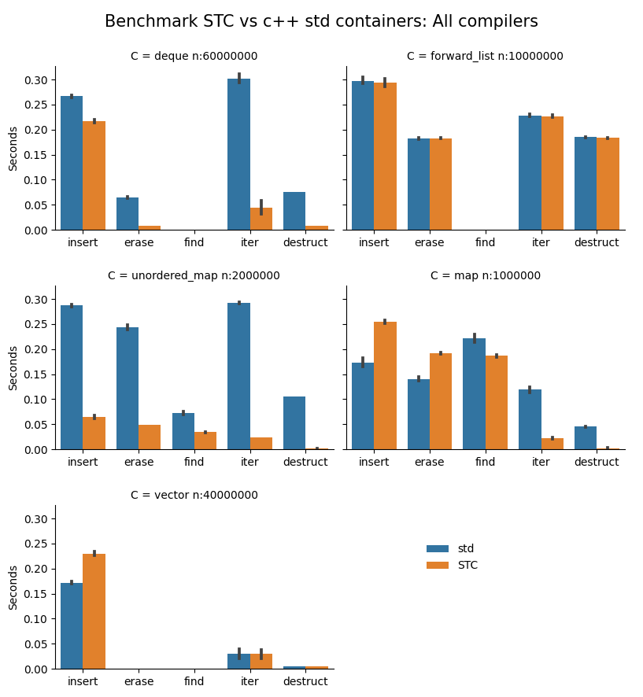

STC - Smart Template Containers
===============================

### [Version 5.0 beta 5](#version-history)
- New shorthand template parameter `i_TYPE` lets you define `i_type`, `i_key`, and `i_val` all in one line.
- [**c_filter(C, cnt, filters)**](docs/algorithm_api.md#c_filter) added to `filter.h`: Enforces functional programming paradigm.
- **Breaking changes**:
- Changed coroutine "keyword" `cco_yield();` => **cco_yield;**
- Renamed several function `stc_xxxxx()` => **c_xxxxx()** in `common.h` and `algo/*.h`.
- Renamed all member functions `TYPE_empty()` => **TYPE_is_empty()**.
- Swapped 2nd and 3rd argument in `c_fortoken*()` to make it consistent with all other `c_for*()`, i.e, input object is third/last.
- Renamed templated STC header files. The new default container names are based on the new file names:
  - **vec.h** (from `cvec.h`)
  - **deq.h** (from `cdeq.h`)
  - **list.h** (from `clist.h`)
  - **stack.h** (from `cstack.h`)
  - **queue.h** (from `cqueue.h`)
  - **pque.h** (from `cpque.h`)
  - **hmap.h** (from `cmap.h`)
  - **hset.h** (from `cset.h`)
  - **smap.h** (from `csmap.h`)
  - **sset.h** (from `csset.h`)
  - **zsview.h** (from `czview.h`)
  - **types.h** (from `forward.h`)
- **Note**: Old headers are removed as of the STC V5.0 release.
---
Description
-----------
STC is a *modern*, *typesafe*, *fast* and *compact* container and algorithms library for C99.
The API naming is similar to C++ STL, but it takes inspiration from Rust and Python as well.
The library handles everything from trivial to highly complex data using *templates*.

Containers
----------
- [***arc*** - (atomic) reference counted smart pointer`](docs/arc_api.md)
- [***box*** - heap allocated element wrapped in a smart pointer`](docs/box_api.md)
- [***cbits*** - dynamic bitset](docs/cbits_api.md)
- [***list*** - forward linked list](docs/list_api.md)
- [***stack*** - stack type](docs/stack_api.md)
- [***vec*** - vector type](docs/vec_api.md)
- [***deq*** - double ended queue (deque)](docs/deq_api.md)
- [***queue*** - queue type](docs/queue_api.md)
- [***pque*** - priority queue](docs/pque_api.md)
- [***hmap*** - hashmap (unordered)](docs/hmap_api.md)
- [***hset*** - hashset (unordered)](docs/hset_api.md)
- [***smap*** - sorted binary tree map](docs/smap_api.md)
- [***sset*** - sorted binary tree set](docs/sset_api.md)
- [***cstr*** - string type (short string optimized)](docs/cstr_api.md)
- [***csview*** - string view (non-zero terminated)](docs/csview_api.md)
- [***zsview*** - zero-terminated string view](docs/zsview_api.md)
- [***cspan*** - single and multidimensional span](docs/cspan_api.md)

Algorithms
----------
- [***Ranged for-loops*** - c_foreach, c_forpair, c_forlist](docs/algorithm_api.md#ranged-for-loops)
- [***Range algorithms*** - c_forrange, crange, c_filter](docs/algorithm_api.md#range-algorithms)
- [***Generic algorithms*** - c_init, c_find_if, c_erase_if, quicksort, lower_bound, ...](docs/algorithm_api.md#generic-algorithms)
- [***Coroutines*** - ergonomic portable coroutines](docs/coroutine_api.md)
- [***Regular expressions*** - Rob Pike's Plan 9 regexp modernized!](docs/cregex_api.md)
- [***Random numbers*** - a very fast *PRNG* based on *SFC64*](docs/crandom_api.md)
- [***Command line argument parser*** - similar to *getopt()*](docs/coption_api.md)

---
List of contents
-----------------
- [Highlights](#highlights)
- [STC is unique!](#stc-is-unique)
- [Performance](#performance)
- [Naming conventions](#naming-conventions)
- [Usage](#usage)
- [Installation](#installation)
- [Specifying template parameters](#specifying-template-parameters)
- [Specifying comparison parameters](#specifying-comparison-parameters)
- [The *emplace* methods](#the-emplace-methods)
- [The *erase* methods](#the-erase-methods)
- [User-defined container type name](#user-defined-container-type-name)
- [Forward declarations](#forward-declarations)
- [Per container-instance customization](#per-container-instance-customization)
- [Memory efficiency](#memory-efficiency)

---
## Highlights

- **Minimal boilerplate code** - Specify only the required template parameters, and leave the rest as defaults.
- **Fully type safe** - Because of templating, it avoids error-prone casting of container types and elements back and forth from the containers.
- **High performance** - Unordered maps and sets, queues and deques are significantly faster than the C++ STL containers, the remaining are similar or close to STL in speed (See graph below).
- **Fully memory managed** - Containers destructs keys/values via default or user supplied drop function. They may be cloned if element types are clonable. Also, smart pointers are supported and can be stored in containers. See [***arc***](docs/arc_api.md) and [***box***](docs/box_api.md).
- **Uniform, easy-to-learn API** - Just include the headers and you are good. The API and functionality resembles c++ STL and is fully listed in the docs. Intuitive method/type names and uniform usage across the various containers.
- **No signed/unsigned mixing** - Unsigned sizes and indices mixed with signed for comparison and calculation is asking for trouble. STC only uses signed numbers in the API for this reason.
- **Small footprint** - Small source code and generated executables. The executable from the example below using *four different* container types is only ***19 Kb in size*** compiled with gcc -O3 -s on Linux.
- **Dual mode compilation** - By default it is a simple header-only library with inline and static methods only, but you can easily switch to create a traditional library with shared symbols, without changing existing source files. See the [installation section](#installation).
- **No callback functions** - All passed template argument functions/macros are directly called from the implementation, no slow callbacks which requires storage.
- **Compiles with C++ and C99** - C code can be compiled with C++ (container element types must be POD).
- **Forward declaration** - Templated containers may be [forward declared](#forward-declarations) without including the full API/implementation.
- **Extendable containers** - STC provides a mechanism to wrap containers inside a struct with [custom data per instance](#per-container-instance-customization).

---
## STC is unique!

1. ***Centralized analysis of template parameters***. The analyser assigns values to all
non-specified template parameters (based on the specified ones) using meta-programming, so
that you don't have to! You may specify a set of "standard" template parameters for each
container, but as a minimum *only one is required*: `i_key` (+ `i_val` for maps). In this
case, STC assumes that the elements are of basic types. For non-trivial types, additional
template parameters must be given.
2. ***Alternative insert/lookup type***. You may specify an alternative type to use for
lookup in containers. E.g., containers with STC string elements (**cstr**) uses `const char*`
as lookup type, so constructing a `cstr` (which may allocate memory) for the lookup
*is not needed*. Hence, the alternative lookup key does not need to be destroyed after use,
as it is normally a POD type. Finally, the key may be passed to an ***emplace***-function.
So instead of calling e.g. `vec_str_push(&vec, cstr_from("Hello"))`, you may call
`vec_str_emplace(&vec, "Hello")`, which is functionally identical, but more convenient.
3. ***Standardized container iterators***. All containers can be iterated in the same manner, and all use the
same element access syntax. E.g.:
    - `c_foreach (it, MyInts, myints) *it.ref += 42;` works for any container defined as
    `MyInts` with `int` elements.
    - `c_foreach (it, MyInts, it1, it2)  *it.ref += 42;` iterates from `it1` up to not including `it2`.

---
## Performance

STC is a fast and memory efficient library, and code compiles fast:



Benchmark notes:
- The barchart shows average test times over three compilers: **Mingw64 13.1.0, Win-Clang 16.0.5, VC-19-36**. CPU: **Ryzen 7 5700X**.
- Containers uses value types `uint64_t` and pairs of `uint64_t` for the maps.
- Black bars indicates performance variation between various platforms/compilers.
- Iterations and access are repeated 4 times over n elements.
- access: no entryfor *forward_list*, *deque*, and *vector* because these c++ containers does not have native *find()*.
- **deque**: *insert*: n/3 push_front(), n/3 push_back()+pop_front(), n/3 push_back().
- **map and unordered map**: *insert*: n/2 random numbers, n/2 sequential numbers. *erase*: n/2 keys in the map, n/2 random keys.

---
## Naming conventions

- Non-templated container names are prefixed by `c`, e.g. `cstr`, `cbits`, `cregex`.
- Public STC macros and "keywords" are prefixed by `c_`, e.g. `c_foreach`, `c_init`.
- Template parameter macros are prefixed by `i_`, e.g. `i_key`, `i_type`.
- All owning containers can be initialized with `{0}` (also `cstr`), i.e. no heap allocation initially.
- Common types for a container type Cont:
    - Cont
    - Cont_value
    - Cont_raw
    - Cont_iter

- Functions that are available for most all containers:
    - Cont_init()
    - Cont_reserve(&con, capacity)
    - Cont_drop(&con)
    - Cont_is_empty(&con)
    - Cont_size(&con)
    - Cont_clone(con)
    - Cont_push(&con, value)
    - Cont_emplace(&con, rawval)
    - Cont_erase_at(&con, iter)
    - Cont_front(&con)
    - Cont_back(&con)
    - Cont_begin(&con)
    - Cont_end(&con)
    - Cont_next(&iter)
    - Cont_advance(iter, n)

---
## Usage
STC containers have similar functionality to the C++ STL standard containers. All containers except for a few,
like **cstr** and **cbits** are generic/templated. No type casting is used, so containers are type-safe like
templated types in C++. However, to specify template parameters with STC, you define them as macros prior to
including the container, e.g.
```c
#define i_TYPE Floats, float // Container type (name, element type)
#include "stc/vec.h"         // "instantiate" the desired container type
#include <stdio.h>

int main(void)
{
    Floats nums = {0};
    Floats_push(&nums, 30.f);
    Floats_push(&nums, 10.f);
    Floats_push(&nums, 20.f);

    for (int i = 0; i < Floats_size(&nums); ++i)
        printf(" %g", nums.data[i]);

    c_foreach (i, Floats, nums)     // Alternative and recommended way to iterate.
        printf(" %g", *i.ref);      // i.ref is a pointer to the current element.

    Floats_drop(&nums); // cleanup memory
}
```
Note that `i_val*` template parameters can be used instead of `i_key*` for *non-map* containers.

Switching to a different container type, e.g. a sorted set (sset):

[ [Run this code](https://godbolt.org/z/ehzns5Pd9) ]
```c
#define i_TYPE Floats, float
#include "stc/sset.h" // Use a sorted set instead
#include <stdio.h>

int main(void)
{
    Floats nums = {0};
    Floats_push(&nums, 30.f);
    Floats_push(&nums, 10.f);
    Floats_push(&nums, 20.f);

    // print the numbers (sorted)
    c_foreach (i, Floats, nums)
        printf(" %g", *i.ref);

    Floats_drop(&nums);
}
```
Comparison/lookup functions are enabled by default for associative containers and priority queue (hmap, hset, smap, sset, pque). To enable it for the remaining containers, define `i_cmp` or `i_less` (and optionally `i_eq`) on the element type. If the element is an integral type, simply define `i_use_cmp` to use `<` and `==` operators for comparisons.

Note that for `#define i_key_class Type`, defining `i_use_cmp` means that *Type_cmp()* function is expected to exist (along with *Type_clone()* and *Type_drop()*).

To summarize, `i_use_cmp` is only needed to enable comparison (sort/search) functions when defining stack, vec, queue, deq, arc, box. With built-in types, it enables the comparison operators, whereas for keyclass types, it binds comparison to its Type_cmp() function.

If an element destructor `i_keydrop` is defined, `i_keyclone` function is required.
*Alternatively `#define i_opt c_no_clone` to disable container cloning.*

Let's make a vector of vectors, which can be cloned. All of its element vectors will be destroyed when destroying the Vec2D.

[ [Run this code](https://godbolt.org/z/vnMeG6qj9) ]
```c
#include <stdio.h>
#include "stc/algorithm.h"

#define i_TYPE Vec,float
#define i_use_cmp        // enable default ==, < and hash operations
#include "stc/vec.h"

#define i_type Vec2D
#define i_key_class Vec  // Use i_key_class when key type has "members" _clone() and _drop().
#define i_use_eq         // vec does not have _cmp(), but it has _eq()
#include "stc/vec.h"

int main(void)
{
    Vec* v;
    Vec2D vec_a = {0};                  // All containers in STC can be initialized with {0}.
    v = Vec2D_push(&vec_a, Vec_init()); // push() returns a pointer to the new element in vec.
    Vec_push(v, 10.f);
    Vec_push(v, 20.f);

    v = Vec2D_push(&vec_a, Vec_init());
    Vec_push(v, 30.f);
    Vec_push(v, 40.f);

    Vec2D vec_b = c_init(Vec2D, {
        c_init(Vec, {10.f, 20.f}),
        c_init(Vec, {30.f, 40.f}),
    });
    printf("vec_a == vec_b is %s.\n", Vec2D_eq(&vec_a, &vec_b) ? "true":"false");

    Vec2D clone = Vec2D_clone(vec_a);   // Make a deep-copy of vec

    c_foreach (i, Vec2D, clone)         // Loop through the cloned vector
        c_foreach (j, Vec, *i.ref)
            printf(" %g", *j.ref);

    c_drop(Vec2D, &vec_a, &vec_b, &clone);  // Free all 9 vectors.
}
```
This example uses four different container types:

[ [Run this code](https://godbolt.org/z/oEhMbGn6E) ]
```c
#include <stdio.h>

#define i_key int
#include "stc/hset.h"   // hset_int: unordered/hash set (assume i_key is basic type, uses `==` operator)

struct Point { float x, y; };
// Define cvec_pnt and enable linear search by defining i_eq
#define i_TYPE vec_pnt, struct Point
#define i_eq(a, b) (a->x == b->x && a->y == b->y)
#include "stc/vec.h"    // vec_pnt: vector of struct Point

#define i_key int
#define i_use_cmp       // enable sort/search. Use native `<` and `==` operators
#include "stc/list.h"   // list_int: singly linked list

#define i_TYPE smap_int, int, int
#include "stc/smap.h"  // sorted map int => int

int main(void)
{
    // Define four empty containers
    hset_int set = {0};
    vec_pnt vec = {0};
    list_int lst = {0};
    smap_int map = {0};

    c_defer( // Drop the containers at scope exit
        hset_int_drop(&set),
        vec_pnt_drop(&vec),
        list_int_drop(&lst),
        smap_int_drop(&map)
    ){
        enum{N = 5};
        int nums[N] = {10, 20, 30, 40, 50};
        struct Point pts[N] = { {10, 1}, {20, 2}, {30, 3}, {40, 4}, {50, 5} };
        int pairs[N][2] = { {20, 2}, {10, 1}, {30, 3}, {40, 4}, {50, 5} };

        // Add some elements to each container
        for (int i = 0; i < N; ++i) {
            hset_int_insert(&set, nums[i]);
            vec_pnt_push(&vec, pts[i]);
            list_int_push_back(&lst, nums[i]);
            smap_int_insert(&map, pairs[i][0], pairs[i][1]);
        }

        // Find an element in each container
        hset_int_iter i1 = hset_int_find(&set, 20);
        vec_pnt_iter i2 = vec_pnt_find(&vec, (struct Point){20, 2});
        list_int_iter i3 = list_int_find(&lst, 20);
        smap_int_iter i4 = smap_int_find(&map, 20);

        printf("\nFound: %d, (%g, %g), %d, [%d: %d]\n",
                *i1.ref, i2.ref->x, i2.ref->y, *i3.ref,
                i4.ref->first, i4.ref->second);

        // Erase all the elements found
        hset_int_erase_at(&set, i1);
        vec_pnt_erase_at(&vec, i2);
        list_int_erase_at(&lst, i3);
        smap_int_erase_at(&map, i4);

        printf("After erasing the elements found:");
        printf("\n set:");
        c_foreach (i, hset_int, set)
            printf(" %d", *i.ref);

        printf("\n vec:");
        c_foreach (i, vec_pnt, vec)
            printf(" (%g, %g)", i.ref->x, i.ref->y);

        printf("\n lst:");
        c_foreach (i, list_int, lst)
            printf(" %d", *i.ref);

        printf("\n map:");
        c_foreach (i, smap_int, map)
            printf(" [%d: %d]", i.ref->first, i.ref->second);
    }
}
```

Output
```
Found: 20, (20, 2), 20, [20: 2]
After erasing the elements found:
 set: 40 10 30 50
 vec: (10, 1) (30, 3) (40, 4) (50, 5)
 lst: 10 30 40 50
 map: [10: 1] [30: 3] [40: 4] [50: 5]
```
---
## Installation

STC is primarily a "headers-only" library, so most headers can simply be included in your program. By default,
all templated functions are static (many inlined). This is often optimal for both performance and compiled
binary size. However, if container type instances, e.g. a `vec_int` is used used in several translation units,
(e.g. more than 3-4 TUs), consider creating a separate header file for them and link it shared [as described here](#1-include-as-a-header-file). In this case, *one* (of the) c-file must implement the templated container, e.g.:
```c
#define i_implement // define shared symbols
#include "vec_int.h"
```
Note that the non-templated string types **cstr**, **csview** uses shared linking by default (may use static linking by
`#define i_static` before include). Most functions in **csview** are inlined though, and the zero-terminated string view,
**zsview** is fully inlined.

Conveniently, `src\libstc.c` implements all the non-templated functions with shared linking for **cstr**,
**csview**, **cregex**, **utf8**, and **crand**.

Additionally, `#define i_import` works as `i_implement` for **cregex** or **cstr**, but it will also implement
the dependent **utf8** functions (utf8 case conversions, etc.). Or you can simply link with libstc.

---
## Specifying template parameters

Each templated type requires one `#include`, even if it's the same container base type, as described earlier.
The template parameters are given by a `#define i_xxxx` statement, where *xxxx* is the parameter name.
The list of template parameters:

- `i_TYPE` *ConType*, *KeyType*[, *ValType*] is a shorthand for defining `i_type`, `i_key` and `i_val` on one line.
- `i_type` *ConType* - Custom container type name.
- `i_key` *Type* - Element key type. **[required]**. Note: `i_val` *may* be used instead for non-maps (not recommended).
- `i_val` *Type* - Element value type. **[required for]** hmap/smap as the mapped value type.
- `i_cmp` *Func* - Three-way comparison of two *i_keyraw*\* - **[required for]** non-integral *i_keyraw* elements, but also see `i_use_cmp`.
- `i_hash` *Func* - Hash function taking *i_keyraw*\* - defaults to *c_default_hash*. **[required for]** ***hmap/hset*** with non-POD *i_keyraw* elements.
- `i_eq` *Func* - Equality comparison of two *i_keyraw*\* - defaults to *!i_cmp*. Companion with *i_hash*.

Properties:
- `i_opt` *Flags* - Boolean properties: may combine *c_no_clone*, *c_no_atomic*, *c_is_forward*, *c_static*, *c_header* with the *|* separator.

Key:
- `i_keydrop` *Func* - Destroy map/set key func - defaults to empty destructor.
- `i_keyclone` *Func* - **[required if]** *i_keydrop* is defined (exception for **arc**, as it shares).
- `i_keyraw` *Type* - Convertion "raw" type - defaults to *i_key*.
- `i_keyfrom` *Func* - Convertion func *i_key* <= *i_keyraw*.
- `i_keyto` *Func*  - Convertion func *i_key*\* => *i_keyraw*. **[required if]** *i_keyraw* is defined

Val: (hmap/smap mapped value only)
- `i_valdrop` *Func* - Destroy mapped or value func - defaults to empty destruct.
- `i_valclone` *Func* - **[required if]** *i_valdrop* is defined.
- `i_valraw` *Type*  - Convertion "raw" type - defaults to *i_val*.
- `i_valfrom` *Func* - Convertion func *i_val* <= *i_valraw*.
- `i_valto` *Func* - Convertion func *i_val*\* => *i_valraw*.

Specials: Meta-template parameters. Use instead of `i_key` / `i_val`.
- `i_key_class` *Type* - Auto-set standard named functions: *Type_clone()*, *Type_drop()*, *Type_cmp()*, *Type_eq()*, *Type_hash()*.
If `i_keyraw` is defined, it sets `i_keyto` = *Type_toraw()* and `i_keyfrom` = *Type_from()*.
Only functions required by the container type is required to be defined. E.g.:
    - *Type_hash()* and *Type_eq()* are only required by **hmap**, **hset** and smart pointers.
    - *Type_cmp()* is not used by **stack** and **hmap/hset**.
    - *Type_clone()* is not used if *#define i_opt c_no_clone* is specified.
- `i_key_str` - Sets `i_key_class` = *cstr*, `i_tag` = *str*, and `i_keyraw` = *const char*\*. Defines both type convertion
`i_keyfrom`, `i_keyto`, and sets `i_cmp`, `i_eq`, `i_hash` functions with *const char\*\** as argument.
- `i_key_ssv` - Sets `i_key_class` = *cstr*, `i_tag` = *ssv*, and `i_keyraw` = *csview\**. Defines both type convertion
`i_keyfrom`, `i_keyto`, and sets `i_cmp`, `i_eq`, `i_hash` functions with *csview\** as argument.
- `i_key_arcbox` *Type* - Use when *Type* is a smart pointer **arc** or **box**. Defines *i_key_class = Type*, and *i_keyraw = Type\**.
NB: Do not use when defining arc/box types themselves.
- `i_val_class` *Type*, `i_val_str`, `i_val_ssv`, `i_val_arcbox` - Similar rules as for ***key***.

**Notes**:
- Instead of defining `i_*clone`, you may define *i_opt c_no_clone* to disable *clone* functionality.
- For `i_key_class`, if *i_keyraw* is defined along with it, *i_keyfrom* may also be defined to enable the *emplace*-functions. NB: the signature for ***cmp***, ***eq***, and ***hash*** uses *i_keyraw* as input.

## Specifying comparison parameters

The table below shows the template parameters which must be defined to support element search and sort for various containers versus element types.

For the containers marked ***optional***, the features are disabled if the template parameter(s) are not defined. Note that the ***(integral type)*** columns also applies to "special" types, specified with `i_key_str`, `i_key_arcbox`, and `i_key_class`, and not only true integral types like `int` or `float`.

| Container         | find (integral type) | sort (integral type) |\|| find (struct elem) | sort (struct elem) | optional |
|:------------------|:---------------------|:---------------------|:-|:-----------------|:-------------------|:---------|
| stack, queue      | n/a                  | n/a                  || n/a                | n/a                | n/a      |
| vec, deq, list    | `i_use_cmp`          | `i_use_cmp`          || `i_eq`             | `i_cmp` / `i_less` | yes      |
| box, arc          | `i_use_cmp`          | `i_use_cmp`          || `i_eq` + `i_hash`  | `i_cmp` / `i_less` | yes      |
| hmap, hset        |                      | n/a                  || `i_eq` + `i_hash`  | n/a                | no       |
| smap, sset        |                      |                      || `i_cmp` / `i_less` | `i_cmp` / `i_less` | no       |
| pque              | n/a                  |                      || n/a                | `i_cmp` / `i_less` | no       |

---
## The *emplace* methods

STC, like c++ STL, has two sets of methods for adding elements to containers. One set begins
with **emplace**, e.g. *vec_X_emplace_back()*. This is an ergonimic alternative to
*vec_X_push_back()* when dealing non-trivial container elements, e.g. strings, shared pointers or
other elements using dynamic memory or shared resources.

The **emplace** methods ***constructs*** / ***clones*** the given element when they are added
to the container. In contrast, the *non-emplace* methods ***moves*** the element into the
container.

**Note**: For containers with integral/trivial element types, or when neither `i_keyraw/i_valraw` is defined,
the **emplace** functions are ***not*** available (or needed), as it can easier lead to mistakes.

| non-emplace: Move          | emplace: Embedded copy         | Container                                   |
|:---------------------------|:-------------------------------|:--------------------------------------------|
| insert(), push()           | emplace()                      | hmap, smap, hset, sset                    |
| insert_or_assign()         | emplace_or_assign()            | hmap, smap                                 |
| push()                     | emplace()                      | queue, pque, stack                       |
| push_back(), push()        | emplace_back()                 | deq, list, vec                           |
| push_front()               | emplace_front()                | deq, list                                 |

Strings are the most commonly used non-trivial data type. STC containers have proper pre-defined
definitions for cstr container elements, so they are fail-safe to use both with the **emplace**
and non-emplace methods:
```c
#define i_implement     // define in ONE file to implement longer functions in cstr
#include "stc/cstr.h"

#define i_key_str       // special macro to enable container of cstr
#include "stc/vec.h"   // vector of string (cstr)
...
vec_str vec = {0};
cstr s = cstr_lit("a string literal");
const char* hello = "Hello";

vec_str_push(&vec, cstr_from(hello);    // make a cstr from const char* and move it onto vec
vec_str_push(&vec, cstr_clone(s));      // make a cstr clone and move it onto vec

vec_str_emplace(&vec, "Yay, literal");  // internally make a cstr from const char*
vec_str_emplace(&vec, cstr_clone(s));   // <-- COMPILE ERROR: expects const char*
vec_str_emplace(&vec, cstr_str(&s));    // Ok: const char* input type.

cstr_drop(&s)
vec_str_drop(&vec);
```
This is made possible because the type configuration may be given an optional
conversion/"rawvalue"-type as template parameter, along with a back and forth conversion
methods to the container value type.

Rawvalues are primarily beneficial for **lookup** and **map insertions**, however the
**emplace** methods constructs `cstr`-objects from the rawvalues, but only when required:
```c
hmap_str_emplace(&map, "Hello", "world");
// Two cstr-objects were constructed by emplace

hmap_str_emplace(&map, "Hello", "again");
// No cstr was constructed because "Hello" was already in the map.

hmap_str_emplace_or_assign(&map, "Hello", "there");
// Only cstr_lit("there") constructed. "world" was destructed and replaced.

hmap_str_insert(&map, cstr_lit("Hello"), cstr_lit("you"));
// Two cstr's constructed outside call, but both destructed by insert
// because "Hello" existed. No mem-leak but less efficient.

it = hmap_str_find(&map, "Hello");
// No cstr constructed for lookup, although keys are cstr-type.
```
Apart from strings, maps and sets are normally used with trivial value types. However, the
last example on the **hmap** page demonstrates how to specify a map with non-trivial keys.

---
## The *erase* methods

| Name                      | Description                  | Container                                   |
|:--------------------------|:-----------------------------|:--------------------------------------------|
| erase()                   | key based                    | smap, sset, hmap, hset, cstr              |
| erase_at()                | iterator based               | smap, sset, hmap, hset, vec, deq, list |
| erase_range()             | iterator based               | smap, sset, vec, deq, list             |
| erase_n()                 | index based                  | vec, deq, cstr                            |
| remove()                  | remove all matching values   | list                                       |

---
## User-defined container type name

Define `i_type` instead of `i_tag`, or `i_TYPE` to define both `i_type` and `i_key`:
```c
#define i_type MyVec
#define i_key int
// #define i_TYPE MyVec,int // shorthand
#include "stc/vec.h"

MyVec vec = {0};
MyVec_push(&vec, 42);
...
```

---
## Forward declarations

There are two ways to pre-declare templated containers in header files:

1. Include the templated container type instance as a header file. This also exposes all container
functions, which can be used by client code. It requires that the element type is complete.
2. Or, pre-declare the container type only. In this case, the container can be a "private" member of a
user struct (the container functions will not be available to the user).

### 1. Include as a header file

Create a dedicated header for the container type instance:
```c
#ifndef PointVec_H_
#define PointVec_H_
// Do not to include user defined headers here if they use templated containers themselves

// NB! struct Point must be complete at this point!
#define i_TYPE PointVec,struct Point
#define i_header    // Do not implement, only expose API
#include "stc/vec.h"

#endif
```
Usage from e.g. other headers is trivial:
```c
#ifndef Dataset_H_
#define Dataset_H_
#include "Point.h"         // include element type separately
#include "PointVec.h"

typedef struct Dataset {
    PointVec vertices;
    PointVec colors;
} Dataset;
...
#endif
```

Implement PointVec in a c-file:
```c
#include "Point.h"
#define i_implement        // define immediately before PointVec.h
#include "PointVec.h"
...
```

### 2. Forward declare only
```c
// Dataset.h
#ifndef Dataset_H_
#define Dataset_H_
#include "stc/types.h"   // include various container data structure templates

// declare PointVec. Note: struct Point may be an incomplete/undeclared type.
forward_vec(PointVec, struct Point);

typedef struct Dataset {
    PointVec vertices;
    PointVec colors;
} Dataset;

void Dataset_drop(Dataset* self);
...
#endif
```
Define and use the "private" container in the c-file:
```c
// Dataset.c
#include "Dataset.h"
#include "Point.h"                        // Point must be defined here.

#define i_is_forward                      // flag that the container was forward declared.
#define i_type PointVec
#define i_val struct Point
#include "stc/vec.h"                     // Implements PointVec with static linking by default
...
```
---
## Per container-instance customization
Sometimes it is useful to extend a container type to store extra data, e.g. a comparison
or allocator function pointer or a context which the function pointers can use. Most
libraries solve this by adding an opaque pointer (void*) or function pointer(s) into
the data structure for the user to manage. This solution has a few disadvantages: the
pointers are not typesafe, and they take up space when not needed. STC solves this by letting
the user create a container wrapper struct where both the container and extra data fields can
be stored. The template parameters may then access the extra data using the "container_of"
technique.

The example below shows how to customize containers to work with PostgreSQL memory management.
It adds a MemoryContext to each container by defining the `i_extend` template parameter followed
the by inclusion of `"stc/extend.h"`. Note that `pgs_realloc` and `pgs_free` is also passed the
allocated size of the given pointer, unlike standard `realloc` and `free`.
```c
// stcpgs.h
#define pgs_malloc(sz) MemoryContextAlloc(c_extend()->memctx, sz)
#define pgs_calloc(n, sz) MemoryContextAllocZero(c_extend()->memctx, (n)*(sz))
#define pgs_realloc(p, old_sz, sz) (p ? repalloc(p, sz) : pgs_malloc(sz))
#define pgs_free(p, sz) (p ? pfree(p) : (void)0) // pfree/repalloc does not accept NULL.

#define i_allocator pgs
#define i_no_clone
#define i_extend MemoryContext memctx;
#include "stc/extend.h"
```
To use it, define both `i_type` and `i_container` (the container type) before including the custom header:
```c
#define i_type IMap
#define i_key int
#define i_val int
#define i_container smap
#include "stcpgs.h"

// Note the wrapper struct type is IMap_ext. IMap is accessed by .get
void maptest()
{
    IMap_ext map = {.memctx=CurrentMemoryContext};
    c_forrange (i, 1, 16)
        IMap_insert(&map.get, i*i, i);

    c_foreach (i, IMap, map.get)
        printf("%d:%d ", i.ref->first, i.ref->second);

    IMap_drop(&map.get);
}
```
---
## Memory efficiency

STC is generally very memory efficient. Memory usage for the different containers:
- **cstr**, **vec**, **stack**, **pque**: 1 pointer, 2 intptr_t + memory for elements.
- **csview**, 1 pointer, 1 intptr_t. Does not own data!
- **cspan**, 1 pointer and 2 \* dimension \* int32_t. Does not own data!
- **list**: Type size: 1 pointer. Each node allocates a struct to store its value and a next pointer.
- **deq**, **queue**:  Type size: 2 pointers, 2 intptr_t. Otherwise like *vec*.
- **hmap/hset**: Type size: 2 pointers, 2 int32_t (default). *hmap* uses one table of keys+value, and one table of precomputed hash-value/used bucket, which occupies only one byte per bucket. The closed hashing has a default max load factor of 85%, and hash table scales by 1.5x when reaching that.
- **smap/sset**: Type size: 1 pointer. *smap* manages its own ***array of tree-nodes*** for allocation efficiency. Each node uses two 32-bit ints for child nodes, and one byte for `level`, but has ***no parent node***.
- **arc**: Type size: 1 pointer, 1 long for the reference counter + memory for the shared element.
- **box**: Type size: 1 pointer + memory for the pointed-to element.

---
# Version History

## Version 4.3
- Breaking changes:
    - **cstr** and **csview** now uses *shared linking* by default. Implement by either defining `i_implement` or `i_static` before including.
    - Renamed "stc/calgo.h" => `"stc/algorithm.h"`
    - Moved "stc/algo/coroutine.h" => `"stc/coroutine.h"`
        - Much improved with some new API and added features.
    - Removed deprecated "stc/crandom.h". Use `"stc/crand.h"` with the new API.
        - Reverted names _unif and _norm back to `_uniform` and `_normal`.
    - Removed default comparison for **list**, **vec** and **deq**:
        - Define `i_use_cmp` to enable comparison for built-in i_key types (<, ==).
        - Use of `i_key_class` still expects comparison functions to be defined.
        - Use of `i_key_arcbox` compares stored pointers instead of pointed to values if comparison not defined.
    - Renamed input enum flags for ***cregex***-functions.
- **cspan**: Added **column-major** order (fortran) multidimensional spans and transposed views (changed representation of strides).
- All new faster and smaller **queue** and **deq** implementations, using a circular buffer.
- Renamed i_extern => `i_import` (i_extern deprecated).
    - Define `i_import` before `#include "stc/cstr.h"` will also define full utf8 case conversions.
    - Define `i_import` before `#include "stc/cregex.h"` will also define cstr + utf8 tables.
- Renamed c_make() => ***c_init()*** macro for initializing containers with element lists. c_make deprecated.
- Removed deprecated uppercase flow-control macro names.
- Other smaller additions, bug fixes and improved documentation.

## Version 4.2
- New home! And online single headers for https://godbolt.org
    - Library: https://github.com/stclib/STC
    - Headers, e.g. https://raw.githubusercontent.com/stclib/stcsingle/main/stc/vec.h
- Much improved documentation
- Added Coroutines + documentation
- Added new crand.h API & header. Old crandom.h is deprecated.
- Added `c_const_cast()` typesafe macro.
- Removed RAII macros usage from examples
- Renamed c_flt_count(i) => `c_flt_counter(i)`
- Renamed c_flt_last(i) => `c_flt_getcount(i)`
- Renamed c_ARRAYLEN() => c_arraylen()
- Removed deprecated c_ARGSV(). Use c_SV()
- Removed c_PAIR

## Version 4.1.1
Major changes:
- A new exciting [**cspan**](docs/cspan_api.md) single/multi-dimensional array view (with numpy-like slicing).
- Signed sizes and indices for all containers. See C++ Core Guidelines by Stroustrup/Sutter: [ES.100](https://isocpp.github.io/CppCoreGuidelines/CppCoreGuidelines#es100-dont-mix-signed-and-unsigned-arithmetic), [ES.102](https://isocpp.github.io/CppCoreGuidelines/CppCoreGuidelines#es102-use-signed-types-for-arithmetic), [ES.106](https://isocpp.github.io/CppCoreGuidelines/CppCoreGuidelines#es106-dont-try-to-avoid-negative-values-by-using-unsigned), and [ES.107](https://isocpp.github.io/CppCoreGuidelines/CppCoreGuidelines#es107-dont-use-unsigned-for-subscripts-prefer-gslindex).
- Customizable allocator [per templated container type](https://github.com/tylov/STC/discussions/44#discussioncomment-4891925).
- Updates on **cregex** with several [new unicode character classes](docs/cregex_api.md#regex-cheatsheet).
- Algorithms:
    - [crange](docs/algorithm_api.md#crange) - similar to [boost::irange](https://www.boost.org/doc/libs/release/libs/range/doc/html/range/reference/ranges/irange.html) integer range generator.
    - [c_forfilter](docs/algorithm_api.md#c_forfilter) - ranges-like view filtering.
    - [csort](include/stc/algo/quicksort.h) - [fast quicksort](misc/benchmarks/various/quicksort_bench.c) with custom inline comparison.
- Renamed `c_ARGSV()` => `c_SV()`: **csview** print arg. Note `c_sv()` is shorthand for *csview_from()*.
- Support for [uppercase flow-control](include/stc/priv/altnames.h) macro names in common.h.
- Some API changes in **cregex** and **cstr**.
- Create single header container versions with python script.


## API changes summary V4.0
- Added **cregex** with documentation - powerful regular expressions.
- Added: `c_forfilter`: container iteration with "piped" filtering using && operator. 4 built-in filters.
- Added: **crange**: number generator type, which can be iterated (e.g. with *c_forfilter*).
- Added back **coption** - command line argument parsing.
- New + renamed loop iteration/scope macros:
    - `c_forlist`: macro replacing *c_forarray* and *c_apply*. Iterate a compound literal list.
- Updated **cstr**, now always takes self as pointer, like all containers except csview.
- Updated **vec**, **deq**, changed `*_range*` function names.

## Changes version 3.8
- Overhauled some **cstr** and **csview** API:
    - Changed cstr_replace*() => `cstr_replace_at*(self, pos, len, repl)`: Replace at specific position.
    - Changed `cstr_replace_all() cstr_replace*(self, search, repl, count)`: Replace count occurences.
    - Renamed `cstr_find_from()` => `cstr_find_at()`
    - Renamed `cstr_*_u8()` => `cstr_u8_*()`
    - Renamed `csview_*_u8()` => `csview_u8_*()`
    - Added cstr_u8_slice() and csview_u8_slice().
    - Removed `csview_from_s()`: Use `cstr_sv(s)` instead.
    - Added back file coption.h
    - Simplified **cbits** usage: all inlined.
    - Updated docs.

## Changes version 3.7
- NB! Changed self argument from value to const pointer on containers (does not apply to **cstr**):
    - `CNT_size(const CNT *self)`
    - `CNT_capacity(const CNT *self)`
    - `CNT_is_empty(const CNT *self)`
- Now both **stack** and **cbits** can be used with template `i_capacity` parameter: `#define i_capacity <NUM>`. They then use fixed sized arrays, and no heap allocated memory.
- Renamed *cstr_rename_n()* => *cstr_rename_with_n()* as it could be confused with replacing n instances instead of n bytes.
- Fixed bug in `smap.h`: begin() on empty map was not fully initialized.

## Changes version 3.6
- Swapped to new **cstr** (*short string optimized*, aka SSO). Note that `cstr_str(&s)` must be used, `s.str` is no longer usable.
- Removed *redundant* size argument to `i_hash` template parameter and `c_default_hash`. Please update your code.
- Added general `i_keyclone/i_valclone` template parameter: containers of smart pointers (**arc**, **box**) now correctly cloned.
- Allows for `i_key*` template parameters instead of `i_val*` for all containers, not only for **hset** and **sset**.
- Optimized *c_default_hash()*. Therefore *c_hash32()* and *c_hash64()* are removed (same speed).
- Added *.._push()* and *.._emplace()* function to all containers to allow for more generic coding.
- Renamed global PRNGs *stc64_random()* and *stc64_srandom()* to *crand()* and *csrand()*.
- Added some examples and benchmarks for SSO and heterogenous lookup comparison with c++20 (string_bench_*.cpp).
