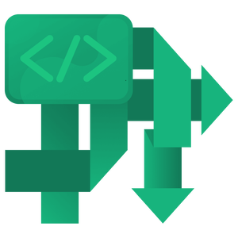

# STC [Coroutines](../include/stc/coroutine.h)


This is a small, portable, ergonomic implementation of coroutines in C99.

* Stackless, fully typesafe coroutines.
* Supports spawning of concurrent tasks using ***fibers/green threads***, managed by the internal scheduler.
* Tasks may be associated with a ***waitgroup***, which must be awaited for to finish.
* Supports both ***asymmetric/structured concurrency*** and ***symmetric transfer*** of control between coroutines.
* Strong error handling and cleanup support. Users may *throw* errors and handle/recover from them up the "call stack"
(resume from the original suspension point).
* Asynchronous coroutine destruction/cleanup supported as standard.
* The coroutine frames/objects will be cleaned up at the `cco_finalize:` label inside the `cco_async` scope.
This will also happen on errors thrown and on coroutine cancellation.
* Fibers are allocated on the heap and automatically freed by the scheduler. Coroutine frames are provided
by the user, and can be either stack or heap allocated.
* Unhandled errors will exit program with an error message including the offending throw's line number.
* Tiny memory usage, about 100 bytes overhead per fiber, and 50 bytes per coroutine object/task.

Because coroutines are stackless, a common usage is to let each coroutine frame store the coroutine
frames to be called/awaited for, typically on the stack. The coroutine frame holds the local
variables and input/output used within its coroutine scope. This has the advantage
that coroutines become truely lightweight and may therefore be used in memory constrained / embedded systems.

The coroutine frames may alternatively be allocated on the heap, e.g. individually allocated just before
they are called/awaited for. In this case, each coroutine must free themselves between the `cco_async`
scope end, and `return 0`.

## Methods and statements

#### Coroutine Basics (both simple and tasks)
```c++
                cco_async (Coroutine* co) {...}                     // The coroutine scope.

                cco_yield;                                          // Suspend execution => cco_yield_v(CCO_YIELD)
                cco_yield_v(status);                                // Suspend execution with custom status returned.
                cco_suspend;                                        // Suspend execution => cco_yield_v(CCO_SUSPEND)
                cco_await(bool condition);                          // Suspend with CCO_AWAIT status or continue if condition is true.
                                                                    // Resumption takes place at the condition test, not after.
                cco_finalize:                                       // Label marks where cleanup of the task/coroutine frame happens.
                                                                    // Jumps here on cco_return, cco_throw(), cco_cancel_task(self).
                cco_return;                                         // Finish coroutine. Jumps to cco_finalize: label. If already passed
                                                                    // it or label is absent, exit the cco_async scope.
                cco_exit();                                         // Cancel current coroutine immediately (skip the cco_finalize: stage).

bool            cco_is_active(Coroutine* co);                       // Is coroutine active/not done?.
bool            cco_is_done(Coroutine* co);                         // Is coroutine done/not active?
void            cco_reset_state(Coroutine* co);                     // Reset state to initial (for reuse).
void            cco_stop(Coroutine* co);                            // Coroutine continues at label cco_finalize if present,
                                                                    // otherwise it exits the cco_async scope on next resume.
```

#### Simple Coroutines (non-Task types)
```c++
                cco_await_coroutine(corofunc(co));                  // Await for coroutine to finish, else suspend with CCO_AWAIT.
                cco_await_coroutine(corofunc(co), int awaitbits);   // Await until coroutine resume status is in (awaitbits | CCO_DONE).
                cco_run_coroutine(corofunc(co)) {};                 // Run blocking until coroutine is finished.
```

#### Tasks (coroutine function-objects) and Fibers (green thread-like entity within a system thread)
```c++
                cco_task_struct(name) {<name>_base base; ...};      // Define a custom coroutine task struct; extends cco_task struct.
                cco_task_struct(name, EnvT) {<name>_base base; ...}; // Also specify value type of pointer returned from cco_env(). Default: void.

                cco_yield_to(cco_task* task);                       // Yield to another task (symmetric transfer of control).
int             cco_resume(cco_task* task);                         // Resume task until next suspension, returns status.
                                                                    // Normally called by cco_run_task() driver function or a scheduler.

                cco_throw(int error);                               // Throw an error. Will unwind call/await-task stack.
                                                                    // Handling of error *is* required else abort().
                cco_throw(CCO_CANCEL);                              // Throw a cancellation of the current task.
                                                                    // It will silently unwind the await stack. Handling *not*
                                                                    // required, but it may be recovered in a cco_finalize: section.
                cco_recover;                                        // Recover from a cco_throw() or cancellation. Resume from the original
                                                                    // suspend point in the current task and clear error status.
                                                                    // Should be done in a cco_finalize: section.
```
#### Task Accessors
```c++
int             cco_status();                                       // Get current return status from last cco_resume() call.
cco_error*      cco_err();                                          // Get error object created from cco_throw(error) call.
                                                                    // Should be handled in a cco_finalize: section.
cco_fiber*      cco_fb(cco_task* task);                             // Get fiber associated with task.
EnvT*           cco_env(cco_task* task);                            // Get environment pointer, stored in the associated fiber.
EnvT*           cco_set_env(cco_task* task, EnvT* env);             // Set environment pointer.
```
#### Task and Waitgroup Cancellation
```c++
                cco_cancel_task(cco_task* task);                    // Cancel a spawned task; If task runs in the current
                                                                    // fiber it equals cco_throw(CCO_CANCEL) (jumps to cco_finalize:).
void            cco_cancel_fiber(cco_fiber* fiber);                 // Signal that fiber will be cancelled upon next suspension point.
void            cco_cancel_group(cco_group* wg);                    // Cancel all spawned tasks in the waitgroup, *except* the current.
                                                                    // Passing NULL as arg will cancel all non-group spawned tasks.
void            cco_cancel_all();                                   // Cancel all spawned tasks, *except* the current.
```
#### Awaiting Tasks and Waitgroups
```c++
                cco_await_task(cco_task* task);                     // Await/call until task's resume status is CCO_DONE (=0).
                cco_await_task(cco_task* task, int awaitbits);      // Await until task's resume status is in (awaitbits | CCO_DONE).
                cco_await_cancel_task(cco_task* task);              // Cancel and await for task to finalize async.
                                                                    // Shorthand for cco_cancel_task() + cco_await_task().

                // If tasks were spawned, all must be awaited for by using these awaiter functions:
                cco_await_group(cco_group* wg);                     // Await for all (remaining) tasks in waitgroup to finish.
                                                                    // Does not await for current task/fiber,
                cco_await_any(cco_group* wg);                       // Await for any one spawned task in waitgroup to
                                                                    // finish, and cancel the remaining.
                cco_await_cancel_group(cco_group* wg);              // Cancel all tasks in wg, and await for them to finalize.
                                                                    // Shorthand for cco_cancel_group() + cco_await_group().
                cco_await_n(cco_group* wg, int n);                  // Awaits for n spawned tasks. Does *not* cancel the remaining.
```
#### Spawning and Running Tasks
The `EnvT` type used below is by default `void`, but can be specified in *cco_task_struct()* definition.
```c++
void            cco_reset_group(cco_group* wg);                     // Reset waitgroup.(Normally not needed).
cco_fiber*      cco_spawn(cco_task* tsk);                           // Lazily spawn a new concurrent task, detatched.
cco_fiber*      cco_spawn(cco_task* tsk, cco_group* wg);            // Lazily spawn a new concurrent task within a waitgroup.
cco_fiber*      cco_spawn(cco_task* tsk, cco_group* wg, EnvT* env); // Variable env may be used as a "promise", or point to input.
cco_fiber*      cco_spawn(cco_task* tsk, cco_group* wg, EnvT* env,  // This may be called from main or outside `cco_async` scope.
                           cco_fiber* fiber);

                cco_run_task(cco_task* tsk) {}                      // Run task blocking until it and spawned fibers are finished.
                cco_run_task(cco_task* tsk, EnvT *env) {}           // Run task blocking with env data
                cco_run_task(fb_iter, cco_task* tsk, EnvT *env) {}  // Run task blocking. fb_iter reference the current fiber.

cco_fiber*      cco_new_fiber(cco_task* tsk);                       // Create an initial fiber from a task.
cco_fiber*      cco_new_fiber(cco_task* tsk, EnvT* env);            // Create an initial fiber from a task and env (inputs or a future).
                cco_run_fiber(cco_fiber** fiber_ref) {}             // Run fiber(s) blocking. Note it takes a (cco_fiber **) as arg.
                cco_run_fiber(fb_iter, cco_fiber* fiber) {}         // Run fiber(s) blocking. fb_iter reference the current fiber.

bool            cco_joined();                                       // Check if all concurrent spawned tasks are joined.
```
#### Timers and Time Functions
```c++
void            cco_start_timer(cco_timer* tm, double sec);         // Start timer with seconds duration.
void            cco_restart_timer(cco_timer* tm);                   // Restart timer with previous duration.
bool            cco_timer_expired(cco_timer* tm);                   // Return true if timer is expired.
double          cco_timer_elapsed(cco_timer* tm);                   // Return elapsed seconds.
double          cco_timer_remaining(cco_timer* tm);                 // Return remaining seconds.
                cco_await_timer(cco_timer* tm, double sec);         // Start timer with duration and await for it to expire.
```
#### Semaphores
```c++
cco_semaphore   cco_make_semaphore(long value);                     // Create semaphore
void            cco_set_semaphore(cco_semaphore* sem, long value);  // Set initial semaphore value
void            cco_acquire_semaphore(cco_semaphore* sem);          // if (count > 0) count -= 1
void            cco_release_semaphore(cco_semaphore* sem);          // "Signal" the semaphore (count += 1)
                cco_await_semaphore(cco_semaphore* sem);            // Await for the semaphore count > 0, then count -= 1
```
#### Interoperability with fb_iterators and Filters
```c++
                // Container fb_iteration within coroutines
                for (cco_each(fb_iter_name, CntType, cnt)) ...;          // Use an existing fb_iterator (stored in coroutine object)
                for (cco_each_reverse(fb_iter_name, CntType, cnt)) ...;  // Iterate in reverse order

                // c_filter() interoperability with coroutine fb_iterators
bool            cco_flt_take(int num);                              // Use instead of *c_flt_take(num)* to ensure cleanup
bool            cco_flt_takewhile(bool predicate);                  // Use instead of *c_flt_takewhile(pred)* to ensure cleanup
```

## Types
| Type name         | Type definition / usage                             | Used to represent... |
|:------------------|:----------------------------------------------------|:---------------------|
|`cco_status`       | **enum** `CCO_DONE`, `CCO_AWAIT`, `CCO_SUSPEND`, `CCO_YIELD` | Default set of return status from coroutines |
|`struct cco_error` | `struct { int32_t code, line; const char* file; }`    | Error object for exceptions |
|`cco_task`         | Enclosure/function object                           | Basic coroutine frame type |
|`cco_timer`        | Struct type                                         | Delay timer               |
|`cco_semaphore`    | Struct type                                         | Synchronization primitive |
|`cco_fiber`        | `struct { int status; }`                                         | Represent a thread-like entity within a thread |

## Rules
1. All cco-features must be called/placed in the ***cco_async*** scope.
2. Avoid declaring local variables within a ***cco_async*** scope. They are only alive until next ***cco_suspend***,
***cco_yield..***, or ***cco_await..***. Normally place them in the coroutine struct. Be particularly careful with
control variables in loops.
3. Do not call ***cco_suspend***, ***cco_yield..*** or ***cco_await..*** inside a `switch` statement. Use `if-else-if` in those cases.
4. Never use regular `return` inside ***cco_async*** scope, always use ***cco_return***.
5. Resuming a coroutine after it has returned 0 (CCO_DONE) is undefined behaviour ***if*** there is additional
code between the ***cco_async*** scope and `return 0`.
6. There may only be one ***cco_async*** scope per coroutine.

## Implementation and examples
A plain coroutine may have any signature, however this implementation has specific support for
coroutines which returns `int`, indicating CCO_DONE, CCO_AWAIT, CCO_SUSPEND, CCO_YIELD, or a custom int value.
It also require a struct pointer as one of the parameters, which must contains a member of type ***cco_base*** named `base`.
The coroutine struct should normally store all *local* variables to be used within the coroutine
(technically those where its usage crosses over a ***cco_yield..***, ***cco_await..*** or a ***cco_suspend***
statement), along with *input* and *output* data/parameters for the coroutine.

Both asymmetric and symmetric coroutine control flow transfer are supported when using ***tasks***
(closures/functors), and they may be combined. Be aware of that cleanup (if needed) is harder to ensure
for symmetric transfer of control (***cco_yield_to***), because there is no automatic transfer back to
the "caller"/*awaiter* when it is finished, like it is in the asymmetric case (***cco_await_task***).

This implementation is not limited to support only a certain set of coroutine types,
like generators. They operate like stackful coroutines, i.e. tasks can efficiently yield
or await within deeply nested coroutines "calls".

----
### Generators

Generator are among the simplest types of coroutines and is easy to write:

[ [Run this code](https://godbolt.org/z/n5fGEcjYj) ]
```c++
#include <stdio.h>
#include <stc/coroutine.h>

struct Gen {
    cco_base base;
    int start, end, value;
};

int Gen(struct Gen* g) {
    cco_async (g) {
        for (g->value = g->start; g->value < g->end; ++g->value)
            cco_yield;
    }
    return 0;
}

int main(void) {
    struct Gen gen = {.start=10, .end=20};

    while (Gen(&gen)) {
        printf("%d, ", gen.value);
    }
}
```
To be more expressive, you may use the `cco_run_coroutine()` macro:
```c++
    cco_run_coroutine(Gen(&gen)) {
        printf("%d, ", gen.value);
    }
```

----
### Iterable generators
Although the generator above is simple to use, sometimes it could be useful to iterate through the items
the way you iterate STC containers. Then you may apply [other algorithms](algorithm_api.md) on the sequence as well.
Notice that `Gen` now becomes the "container", while `Gen_iter` is the coroutine:

<details>
<summary>Iterable generator coroutine implementation</summary>

[ [Run this code](https://godbolt.org/z/4EhPGv7cG) ]
```c++
#include <stdio.h>
#include <stc/coroutine.h>

typedef int Gen_value;
typedef struct {
    Gen_value start, end, value;
} Gen;

typedef struct {
    cco_base base;
    Gen* g;
    Gen_value* ref;
} Gen_iter;

int Gen_next(Gen_iter* it) {
    cco_async (it) {
        for (*it->ref = it->g->start; *it->ref < it->g->end; ++*it->ref)
            cco_yield;

        cco_finalize:
        it->ref = NULL; // stop
    }
    return 0;
}

Gen_iter Gen_begin(Gen* g) {
    Gen_iter it = {.g = g, .ref = &g->value};
    Gen_next(&it); // advance to first
    return it;
}

int main(void) {
    Gen gen = {.start=10, .end=20};

    for (c_each(i, Gen, gen)) {
        printf("%d, ", *i.ref);
    }
}
```

</details>

----
### Actor models of concurrency in video games and simulations
A common usage of coroutines is long-running concurrent tasks, often found in video games. An example of this is the
[Dining philosopher's problem](https://en.wikipedia.org/wiki/Dining_philosophers_problem). The following
implementation uses `cco_await` and `cco_suspend`. It avoids deadlocks by awaiting for both forks to be
available before aquiring them. It also avoids starvation by increasing both neighbor's hunger when a philosopher
starts eating (because they must be waiting).

<details>
<summary>The "Dining philosophers" C implementation</summary>

[ [Run this code](https://godbolt.org/z/vz5rbE7W4) ]
```c++
#include <stdio.h>
#include <time.h>
#include <stc/random.h>
#include <stc/coroutine.h>

enum {num_philosophers = 5};
enum PhMode {ph_THINKING, ph_HUNGRY, ph_EATING};

// Philosopher coroutine: use task coroutine
cco_task_struct (Philosopher) {
    Philosopher_base base; // required
    int id;
    cco_timer tm;
    enum PhMode mode;
    int hunger;
    struct Philosopher* left;
    struct Philosopher* right;
};

int Philosopher(struct Philosopher* o) {
    cco_async (o) {
        while (1) {
            double duration = 1.0 + crand64_real()*2.0;
            printf("Philosopher %d is thinking for %.0f minutes...\n", o->id, duration*10);
            o->hunger = 0;
            o->mode = ph_THINKING;
            cco_await_timer(&o->tm, duration);

            printf("Philosopher %d is hungry...\n", o->id);
            o->mode = ph_HUNGRY;
            cco_await(o->hunger >= o->left->hunger &&
                      o->hunger >= o->right->hunger);
            o->left->hunger += (o->left->mode == ph_HUNGRY); // don't starve the neighbours
            o->right->hunger += (o->right->mode == ph_HUNGRY);
            o->hunger = INT32_MAX;
            o->mode = ph_EATING;

            duration = 0.5 + crand64_real();
            printf("Philosopher %d is eating for %.0f minutes...\n", o->id, duration*10);
            cco_await_timer(&o->tm, duration);
        }
        cco_finalize:
        printf("Philosopher %d done\n", o->id);
    }

    return 0;
}

// Dining coroutine
cco_task_struct (Dining) {
    Dining_base base; // required
    float duration;
    struct Philosopher philos[num_philosophers];
    int i;
    cco_timer tm;
    cco_group wg;
};

int Dining(struct Dining* o) {
    cco_async (o) {
        for (int i = 0; i < num_philosophers; ++i) {
            o->philos[i] = (struct Philosopher){
                .base = {Philosopher},
                .id = i + 1,
                .left = &o->philos[(i - 1 + num_philosophers) % num_philosophers],
                .right = &o->philos[(i + 1) % num_philosophers],
            };
            cco_spawn(&o->philos[i], &o->wg);
        }
        cco_await_timer(&o->tm, o->duration);

        cco_finalize:
        cco_await_cancel_group(&o->wg);
        puts("Dining done");
    }
    return 0;
}

int main(void)
{
    struct Dining dining = {.base={Dining}, .duration=5.0f, .wg = {0}};

    crand64_seed((uint64_t)time(NULL));
    cco_run_task(&dining);
}
```
</details>

----
### Tasks
A task is a coroutine functor/enclosure. Users must define a custom task type, which *extends* the basic ***cco_task***
in a typesafe manner:
```c++
cco_task_struct (MyTask) {
    MyTask_base base;
    ... // other task members
};
```
```c++
// a useful convention is to use same name for the coroutine function as the struct task:
int MyTask(struct MyTask* o) {
    cco_async (o) {
       ...
    }
    return 0;
}

int main(void) {
    struct MyTask task = {{MyTask}}; // create the task on the stack.
    cco_run_task(&task);
}
```

#### Error handling with tasks
Tasks allows for scheduling coroutines and more efficient deep nesting of coroutine calls/awaits.
Also, tasks have an excellent error handling mechanism, i.e. an error can be thrown, which will unwind the "call stack",
and errors may be handled and recoveded higher up in the call tree in a simple, structured manner.

<details>
<summary>Implementation of nested awaiting coroutines with error handling</summary>

The following example shows a task `start` which awaits `TaskA`, => awaits `TaskB`, => awaits `TaskC`. `TaskC` throws
an error, which causes unwinding of the call stack. The error is finally handled in `TaskA`'s `cco_async` scope
and recovered using `cco_recover`. This call will resume control back to the original suspension point in the
current task. Because the "call-tree" is fixed, the coroutine frames to be called may be pre-allocated on the stack,
which is very fast.

[ [Run this code](https://godbolt.org/z/ad15G1rxj) ]
<!---->
```c++
#include <stdio.h>
#include <stc/coroutine.h>

cco_task_struct (TaskA, struct Subtasks) { TaskA_base base; int a; };
cco_task_struct (TaskB, struct Subtasks) { TaskB_base base; double d; };
cco_task_struct (TaskC, struct Subtasks) { TaskC_base base; float x, y; };
cco_task_struct (start, struct Subtasks) { start_base base; };


int TaskC(struct TaskC* o) {
    cco_async (o) {
        printf("TaskC start: {%g, %g}\n", o->x, o->y);

        // assume there is an error...
        cco_throw(99);

        puts("TaskC work");
        cco_yield;
        puts("TaskC more work");

        cco_finalize:
        puts("TaskC done");
    }
    return 0;
}

struct Subtasks {
    struct TaskA task_a;
    struct TaskB task_b;
    struct TaskC task_c;
};

int TaskB(struct TaskB* o) {
    cco_async (o) {
        printf("TaskB start: %g\n", o->d);

        cco_await_task(&cco_env(o)->task_c);
        puts("TaskB work");

        cco_finalize:
        puts("TaskB done");
    }
    return 0;
}

int TaskA(struct TaskA* o) {
    cco_async (o) {
        printf("TaskA start: %d\n", o->a);

        cco_await_task(&cco_env(o)->task_b);

        puts("TaskA work");

        cco_finalize:
        if (cco_err()->code == 99) {
            // if error not handled, will cause 'unhandled error'...
            printf("TaskA recovered error '99' thrown on line %d\n", cco_err()->line);
            cco_recover;
        }
        puts("TaskA done");
    }
    return 0;
}

int start(struct start* o) {
    cco_async (o) {
        puts("start");

        cco_await_task(&cco_env(o)->task_a);

        cco_finalize:
        puts("done");
    }
    return 0;
}


int main(void)
{
    struct Subtasks env = {
        {{TaskA}, 42},
        {{TaskB}, 3.1415},
        {{TaskC}, 1.2f, 3.4f},
    };
    struct start task = {{start}};

    int count = 0;
    cco_run_task(&task, &env) { ++count; }
    printf("resumes: %d\n", count);
}
```
<!---->
</details>

#### Coroutines frames allocated on the heap

Sometimes the call-tree is dynamic or more complex, then we can dynamically allocate the coroutine frames before
they are awaited. This is somewhat more general and simpler, but requires heap allocation. Note that the coroutine
frames are now freed at the end of the coroutine functions, i.e. after cco_async {} scope. Example is based on
the previous, but also shows how to use the env field in `cco_fiber` to return a value from the coroutine
call/await:

<details>
<summary>Implementation of coroutine objects on the heap</summary>

[ [Run this code](https://godbolt.org/z/1j31oPv3W) ]
<!---->
```c++
#include <stdio.h>
#include <stc/coroutine.h>

cco_task_struct (job1) {
    job1_base base;
    cco_timer tm;
};

cco_task_struct (job_start) {
    job_start_base base;
    cco_timer tm;
    cco_group wg;
};


int job1(struct job1* o) {
    cco_async (o) {
        cco_await_timer(&o->tm, 0.2);
        puts("Pong");
        cco_await_timer(&o->tm, 0.2);
    }
    free(o);
    return 0;
}

int job_start(struct job_start* o) {
    cco_async (o) {
        cco_spawn(c_new(struct job1, {{job1}}), &o->wg);
        cco_await_timer(&o->tm, 0.1);
        puts("Ping");
        cco_await_group(&o->wg);
        puts("Ping");
        cco_await_timer(&o->tm, 0.2);
    }
    free(o);
    return 0;
}


int main(void)
{
    cco_fiber* fb = c_new(cco_fiber, {0});

    struct job_start* js = c_new(struct job_start, {{job_start}});
    cco_spawn(js, NULL, NULL, fb);
    cco_run_fiber(&fb);
}
```
<!---->
</details>

----
### Producer-consumer pattern (symmetric coroutines) tasks
Tasks are executed using an *executor*, which is easy to do via the ***cco_run_task()*** macro.
Coroutines awaits (or "calls") other coroutines with ***cco_await_task()***, in which case the awaited coroutine will give
control back to the caller whenever it finishes or reaches a `cco_suspend` or another `cco_await*` suspension point in the
code. This is knows as asymmetric calls.

However, coroutines may also transfer control directly to another coroutine using ***cco_yield_to()***.
In this case, control will not be returned back to caller after it finishes or is suspended, known as a symmetric call.
This is useful when two or more coroutines cooperate like in the simple case of the producer-consumer pattern used in
the following example:

<details>
<summary>Producer-consumer coroutine implementation</summary>

[ [Run this code](https://godbolt.org/z/rTcxfM6h3) ]
```c++
#include <time.h>
#include <stdio.h>
#include <stc/coroutine.h>
#define T Inventory, int
#include <stc/queue.h>

// Example shows symmetric coroutines producer/consumer style.

cco_task_struct (produce) {
    produce_base base; // must be first (compile-time checked)
    struct consume* consumer;
    Inventory inventory;
    int limit, batch, serial, total;
};

cco_task_struct (consume) {
    consume_base base; // must be first
    struct produce* producer;
};


int produce(struct produce* o) {
    cco_async (o) {
        while (1) {
            if (o->serial > o->total) {
                if (Inventory_is_empty(&o->inventory))
                    cco_return; // cleanup and finish
            }
            else if (Inventory_size(&o->inventory) < o->limit) {
                for (c_range(o->batch))
                    Inventory_push(&o->inventory, ++o->serial);

                printf("produced %d items, Inventory has now %d items:\n",
                       o->batch, (int)Inventory_size(&o->inventory));

                for (c_each(i, Inventory, o->inventory))
                    printf(" %2d", *i.ref);
                puts("");
            }

            cco_yield_to(o->consumer); // symmetric transfer
        }

        cco_finalize:
        cco_await_cancel_task(o->consumer);
        Inventory_drop(&o->inventory);
        puts("done producer");
    }
    return 0;
}

int consume(struct consume* o) {
    cco_async (o) {
        int n, sz;
        while (1) {
            n = rand() % 10;
            sz = (int)Inventory_size(&o->producer->inventory);
            if (n > sz) n = sz;

            for (c_range(n))
                Inventory_pop(&o->producer->inventory);
            printf("consumed %d items\n", n);

            cco_yield_to(o->producer); // symmetric transfer
        }

        cco_finalize:
        puts("drop consumer");
        cco_yield; // demo async destruction.
        puts("done consumer");
    }

    return 0;
}

int main(void)
{
    srand((unsigned)time(0));
    struct produce producer = {
        .base = {produce},
        .inventory = {0},
        .limit = 12,
        .batch = 8,
        .total = 50,
    };
    struct consume consumer = {
        .base = {consume},
        .producer = &producer,
    };
    producer.consumer = &consumer;

    cco_run_task(&producer);
}
```

</details>

----
### Scheduled coroutines
The task-objects have the added benefit that coroutines can be managed by a scheduler,
which is useful when dealing with large numbers of coroutines (like in simulations).
Below is a simple coroutine scheduler using a queue. It sends the suspended coroutines
to the end of the queue, and resumes the coroutine in the front.
Note that the scheduler awaits the next CCO_YIELD to be returned, not *only* the default CCO_DONE
(in the code below, `| CCO_DONE` is redundant and only to show how to await for multiple/custom bit-values).

The example heap allocates the coroutine frames on a queue, so that the scheduler can pick the next coroutine to
execute from a pool of coroutines. This also allows it to run on a different thread/scope that may outlive
the scope in that it was created.

<details>
<summary>Scheduled coroutines implementation</summary>

[ [Run this code](https://godbolt.org/z/hj78Ms4Gf) ]
```c++
// Based on https://www.youtube.com/watch?v=8sEe-4tig_A
#include <stdio.h>
#include <stc/coroutine.h>

#define T Tasks, cco_task*, (c_no_clone)
#define i_keydrop(p) c_free_n(*p, 1) // { puts("free task"); c_free_n(*p, 1); }
#include <stc/queue.h>

// Specify Tasks as the environment pointer type:
cco_task_struct (Scheduler, Tasks) {
    Scheduler_base base;
    cco_task* _pulled;
    Tasks tasks;
};

cco_task_struct (TaskA, Tasks) {
    TaskA_base base;
};

cco_task_struct (TaskX) {
    TaskX_base base;
    char id;
};

int scheduler(struct Scheduler* o) {
    cco_async (o) {
        cco_set_env(o, &o->tasks);

        while (!Tasks_is_empty(&o->tasks)) {
            o->_pulled = Tasks_pull(&o->tasks);

            cco_await_task(o->_pulled, CCO_YIELD | CCO_DONE);

            if (cco_status() == CCO_YIELD) {
                Tasks_push(&o->tasks, o->_pulled);
            } else { // CCO_DONE
                Tasks_value_drop(&o->tasks, &o->_pulled);
            }
        }

        cco_finalize:
        Tasks_drop(&o->tasks);
        puts("Task queue dropped");
    }
    return 0;
}

static int taskX(struct TaskX* o) {
    cco_async (o) {
        printf("Hello from task %c\n", o->id);
        cco_yield;
        printf("%c is back doing work\n", o->id);
        cco_yield;
        printf("%c is back doing more work\n", o->id);
        cco_yield;

        cco_finalize:
        printf("%c is done\n", o->id);
    }

    return 0;
}

static int TaskA(struct TaskA* o) {
    cco_async (o) {
        puts("Hello from task A");
        cco_yield;

        puts("A is back doing work");
        cco_yield;

        puts("A adds task C");
        Tasks_push(cco_env(o), cco_cast_task(c_new(struct TaskX, {.base={taskX}, .id='C'})));
        cco_yield;

        puts("A is back doing more work");
        cco_yield;

        cco_finalize:
        puts("A is done");
    }
    return 0;
}

int main(void) {
    // Allocate everything on the heap, so it could be ran in another thread.
    struct Scheduler* schedule = c_new(struct Scheduler, {
        .base={scheduler},
        .tasks = c_make(Tasks, {
            cco_cast_task(c_new(struct TaskA, {.base={TaskA}})),
            cco_cast_task(c_new(struct TaskX, {.base={taskX}, .id='B'})),
        })
    });

    cco_run_task(schedule);

    // schedule is now cleaned up/destructed, free heap mem.
    c_free_n(schedule, 1);
}
```

</details>
